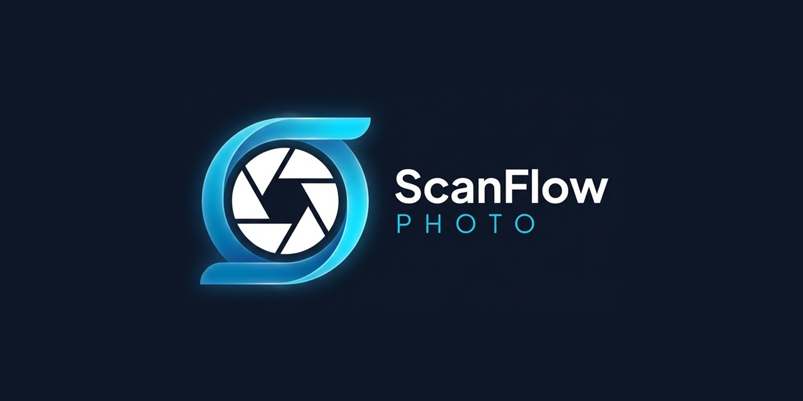
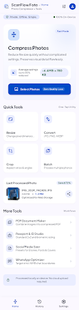
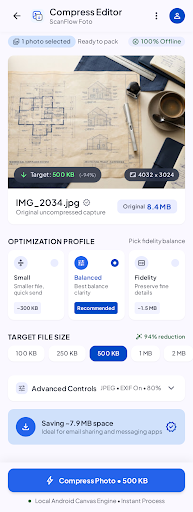
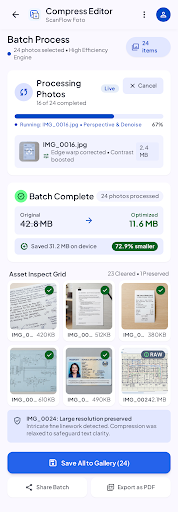
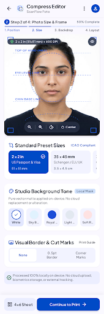
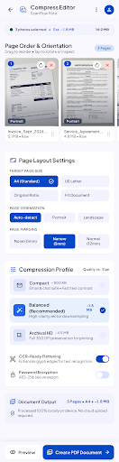

<p align="center">
  
</p>

<p align="center">
  <a href="https://github.com/biputsmk89-a11y/ScanFlow-Photo"></a>
  <a href="https://kotlinlang.org"></a>
  <a href="https://developer.android.com/jetpack/compose"></a>
  
  
</p>

# ScanFlow Photo — Photo Compressor + Image Studio

A state-of-the-art, 100% offline Android photo utility built with Jetpack Compose, Material 3, Kotlin Coroutines, and Clean Architecture.
Modern UI/UX design crafted with Google Stitch.

## 📱 UI Showcase (Google Stitch System)

<p align="center">
  
  
  
  
  
</p>

## 🌟 Key Features

- **Photo Compression**:
  - Precision quality slider (1–100%)
  - Target file size (KB/MB) with iterative binary search convergence and dimension fallback
  - Real-time statistics: Before, After, Saved KB/MB, and Reduction %
- **Image Transformations**:
  - Proportional & custom resizing
  - Freeform and preset aspect-ratio cropping (1:1, 4:3, 16:9, etc.)
  - 90° rotation and orientation correction
- **Format Conversion**:
  - Full cross-format conversion between JPG, PNG, and WebP (Lossy & Lossless)
- **Batch Processing**:
  - Multi-image picker with WorkManager background execution
  - Peak memory safety: strict Concurrency = 1 (only 1 bitmap in-flight at any time)
  - Live progress updates, cooperative cancellation, and smart retry (skips completed items)
- **Advanced Tools**:
  - **Multi-page PDF**: Select, reorder, auto-fit, and generate standardized PDF documents
  - **Passport & ID**: Biometric guideline overlays, standard ID dimensions, and print cut-sheets
  - **Social Media Presets**: Ready-to-use aspect ratios for Instagram, Facebook, YouTube, TikTok
  - **WhatsApp Optimization**: Small, Balanced, and HD presets tailored for messaging
- **Privacy & Metadata**:
  - On-device EXIF metadata stripping and selective GPS removal
  - **100% Offline Processing**: Zero telemetry on photo bytes, paths, or contents
- **Persistent History**:
  - Room database tracking all operations, compression savings, and output files with direct sharing

---

## 🏗 Architecture

The app follows **Clean Architecture** and Android Architecture Components:

```text
UI (Jetpack Compose + Material 3)
       │
Presentation (StateFlow + ViewModels)
       │
Domain (UseCases & Feature Models)
       │
Image Pipeline (ImagePipelineEngine)
 ├── ImageAnalyzer (Bounds & EXIF decoding)
 ├── ResizeEngine / CropEngine / RotateEngine
 ├── CompressionEngine / FormatConverter
 └── OutputValidator
       │
Storage & Persistence
 ├── MediaStore & FileProvider (Scoped Storage)
 ├── Room Database (Processing History)
 └── DataStore (Preferences)
```

---

## 🚀 Building & Testing

### Prerequisites
- JDK 17 (Eclipse Temurin recommended)
- Android SDK (API 34)

### Build Commands
```bash
# Run unit tests
./gradlew test

# Run Android Lint
./gradlew lintDebug

# Assemble Debug APK
./gradlew assembleDebug

# Assemble Release APK (with R8 minification)
./gradlew assembleRelease

# Bundle Release AAB (for Google Play Console)
./gradlew bundleRelease
```

---

## 📦 Build Variants & Artifacts

| Variant | APK Output | AAB Output | Signed | Purpose |
|:---|:---:|:---:|:---:|:---|
| **Debug** | `app/build/outputs/apk/debug/app-debug.apk` | N/A | Debug Key | Local development and UI smoke testing |
| **Release** | `app/build/outputs/apk/release/app-release-unsigned.apk` (or signed) | `app/build/outputs/bundle/release/app-release.aab` | Configurable | Production distribution and Google Play Console upload |

---

## 🤖 GitHub Actions & CI/CD

Automated workflows are located in `.github/workflows/`:
1. **`android-ci.yml`**: Runs on push to `main`/`develop` and on pull requests. Runs tests, lint, and builds debug APK.
2. **`pull-request.yml`**: Validates incoming pull requests.
3. **`android-release.yml`**: Triggered on tag push (`v*.*.*`). Decodes keystore secrets, executes test gates, builds signed APK and AAB, computes SHA-256 checksums, and publishes a formal GitHub Release.

For signing configuration details, see [SIGNING.md](docs/SIGNING.md).  
For the feature registry, see [FEATURES.md](docs/FEATURES.md).  
For the release procedure, see [RELEASE.md](docs/RELEASE.md).

---

## 🔒 Privacy Guarantee

ScanFlow Photo operates entirely offline. All image decoding, transformation, compression, and encoding happen strictly within device memory and private sandboxed caches. No photo, pixel data, or personal information is ever transmitted to external servers.
